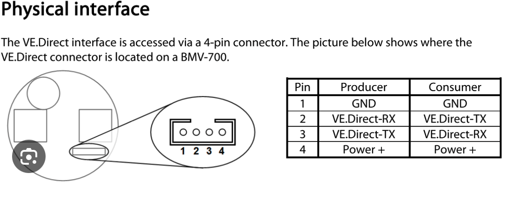

# esp32-victron

ESP32 firmware that reads telemetry from a Victron solar charge controller over VE.Direct and publishes it to MQTT. Built for off-grid cabins with a Victron SmartSolar MPPT and a Node-RED dashboard at home.

## Features

- Parses the VE.Direct **text protocol** from any Victron device that speaks it (developed against a SmartSolar MPPT 100/30 — PID `0xA056`, FW 1.74).
- Publishes a flat JSON payload with values scaled to natural units (V, A, W, kWh) — designed to be dropped straight into Node-RED dashboard gauges.
- **Captive portal** (WiFiManager) for first-boot Wi-Fi + MQTT config. No re-flashing to move the device between networks.
- **MQTT last-will** so the broker knows when the device disconnects.
- **UART self-heal**: the firmware survives the RX FIFO overrun that ESP32 + WiFiManager normally cause during the blocking Wi-Fi connect phase, and recovers from any other transient UART wedges.
- Human-readable labels for charger state (`Bulk`, `Float`, etc.), MPPT state, and error codes — alongside the raw numeric codes.
- Diagnostic `debug` topic with byte counters and a ring buffer of the last 64 received bytes, for troubleshooting wiring.

## Hardware

| Item | Notes |
|---|---|
| ESP32 DevKitC / NodeMCU-32S | `esp32dev` board in PlatformIO |
| Victron SmartSolar MPPT (any model with VE.Direct text protocol) | Tested on 100/30 |
| VE.Direct cable | See "Getting a VE.Direct pigtail" below |
| Power for the ESP32 | See "Powering the ESP32" below |

### Getting a VE.Direct pigtail

Cheapest approach: **buy a VE.Direct cable that has a JST connector on both ends and cut it in half.** You get two pigtails — enough for two ESP32s — for the price of one cable. (Alternative: buy a VE.Direct-to-bare-wires pigtail, slightly tidier but only one per cable.)

### Wiring

VE.Direct on the SmartSolar is 3.3 V TTL, 19200 8N1 — no level shifter needed.

The official VE.Direct pinout (from Victron's protocol docs):



The "Producer" column applies to the Victron (which is producing the data); the "Consumer" column would apply to a downstream device that wanted to *talk back* to the Victron, which we don't.

| Pin | Function on the Victron | Connect to |
|---|---|---|
| 1 | GND | ESP32 GND |
| 2 | VE.Direct-RX (input to Victron) | unused — tape off |
| 3 | VE.Direct-TX (output from Victron) | ESP32 **GPIO16** (UART2 RX) |
| 4 | Power+ (5V) | See "Powering the ESP32" below |

**VE.Direct cable wire colours are not standardised — verify every cable with a multimeter.** Two cables used during development of this project had different colours for the same pins:

| Pin | Cable A (bare-wire pigtail) | Cable B (VE.Direct-to-VE.Direct, cut in half) |
|---|---|---|
| 1 (GND) | Black | Red |
| 2 (RX) | Green | one of green/white |
| 3 (TX) | White | the other of green/white |
| 4 (+5V) | Red | (the remaining colour) |

Verification rule with the Victron powered and a multimeter on DC volts, black probe on confirmed GND:

- Pin 1 (GND) reads **0 V**
- Pin 3 (TX) reads **~2.5–3.3 V**, flickering (this is the wire you want on GPIO16)
- Pin 4 (+5V) reads **~5 V** steady
- Pin 2 (RX) reads ~0 V or floats

### Powering the ESP32

Two options, pick based on how reliable the install needs to be.

**Option A — 12 V → 5 V buck converter off the battery (recommended for unattended cabin installs).** A cheap module (e.g. an LM2596 or MP1584-based board, ~$2) wired between the battery and the ESP32's 5V/VIN pin. Stable, plenty of current headroom, never browns out under Wi-Fi load.

**Option B — direct from VE.Direct Pin 4 (+5V).** Works in practice on most ESP32 dev boards — they accept 5 V on the VIN/5V pin without damage (no magic smoke), so the *voltage* is fine. The *current* is the marginal bit: Victron rates the VE.Direct +5V output around 50 mA, while an ESP32 can spike to 300–500 mA during Wi-Fi TX bursts. Many setups run happily off this anyway; some hit occasional brown-out resets. For a desk-bench setup or a location with stable Wi-Fi (and where a reboot isn't a problem), tapping the VE.Direct +5V directly is the simplest wiring possible. For a remote cabin you can't easily get to, the buck converter is the safer choice.

If you do go with Option B, consider adding a 470–1000 µF bulk capacitor across the ESP32's 5V and GND pins to absorb Wi-Fi current spikes, and optionally a small Schottky diode in series on the +5V line to keep any back-EMF from feeding into the Victron.

## Build and flash

Uses [PlatformIO](https://platformio.org/).

```sh
# clone, then:
pio run -t upload          # build + flash via /dev/cu.usbserial-0001
pio device monitor         # 115200 baud serial console
```

Adjust `upload_port` / `monitor_port` in `platformio.ini` if your serial device has a different name.

## First-boot configuration

1. Power up. The ESP32 opens a Wi-Fi network named `Victron-XXXXXX` (last 6 hex of MAC).
2. Connect a phone or laptop to that network. A captive portal opens automatically.
3. Pick your Wi-Fi and enter the password.
4. Fill in the extra fields:
    - **Device name** — short identifier, becomes the MQTT topic prefix (e.g. `cabin-north`)
    - **MQTT broker host / port**
    - **MQTT username / password** (leave blank for anonymous)
    - **MQTT base topic** — defaults to `victron`
5. Save. The device connects to Wi-Fi, then to MQTT, and starts publishing.

Settings are persisted in NVS. To re-enter the portal, simply put the device somewhere its saved Wi-Fi isn't reachable; it falls back to the portal after 30 s.

## MQTT topics

All under `<base_topic>/<device_name>/`:

| Topic | Cadence | Retained | Description |
|---|---|---|---|
| `state` | every 5 min | no | JSON snapshot of the latest VE.Direct frame |
| `status` | on (dis)connect | yes | `"online"` / `"offline"` (via MQTT last-will) |
| `info` | on connect | yes | Boot info: `{device_id, name, version, ip, mac, event}` |
| `debug` | every 5 min | no | Parser counters and recent raw bytes |

Adjust `PUBLISH_INTERVAL_MS` in `src/main.cpp` to change the interval. Drop it to 10 s while iterating on a dashboard, restore to 5 min for production.

### `state` payload

```json
{
  "pid": "0xA056",
  "fw": "174",
  "sn": "HQ2437N2P9C",
  "day_seq": 40,

  "battery_v": 13.23,
  "battery_i_a": 0.20,
  "battery_p_w": 2.65,

  "panel_v": 17.95,
  "panel_p_w": 3,

  "yield_total_kwh": 260.47,
  "yield_today_kwh": 0.52,
  "yield_today_peak_w": 181,
  "yield_yesterday_kwh": 0.03,
  "yield_yesterday_peak_w": 19,

  "load": "ON",
  "cs":   3, "cs_text":   "Bulk",
  "mppt": 2, "mppt_text": "MPPT active",
  "err":  0, "err_text":  "OK",
  "or_bitmask": "0x00000000",

  "ts_ms": 12345678,
  "version": "0.2.0"
}
```

Fields are omitted when the source device doesn't report them (e.g. `load_i_a` is only present on models with a load output).

## Troubleshooting

| Symptom | Likely cause |
|---|---|
| `info` arrives but `state` never does | Cable wiring (check the `debug` topic's `bytes_seen` counter — if it's growing, the parser is fine; if stuck at 0, it's the wire) |
| `bytes_seen` grows but `frames_valid` stays 0 for >30 s | UART RX desync or wiring noise — check `debug`'s `ring_ascii` for recognisable text |
| `status: offline` permanent | ESP32 lost power or Wi-Fi; if Wi-Fi, captive portal will re-open after 30 s |
| Boot loop / brown-out resets | Most likely under-current from VE.Direct's +5V supply during Wi-Fi bursts. Add a bulk cap, or move to a buck converter off the battery (see Powering the ESP32) |

## Limitations

- The SmartSolar MPPT 100/30 has **no load output**, so the `LOAD` field is always `ON` (placeholder) and there is no `IL` field. The battery current sensor measures **solar charge current only** — it cannot see loads wired directly to the battery. For real load / SOC / time-to-empty, add a Victron SmartShunt or BMV-712 (separate VE.Direct stream — would need firmware support for two UARTs).
- No OTA firmware updates yet — reflashing means USB.
- HEX-protocol responses are ignored (we only consume text frames).

## License

MIT — see `LICENSE` (add one if you fork).
